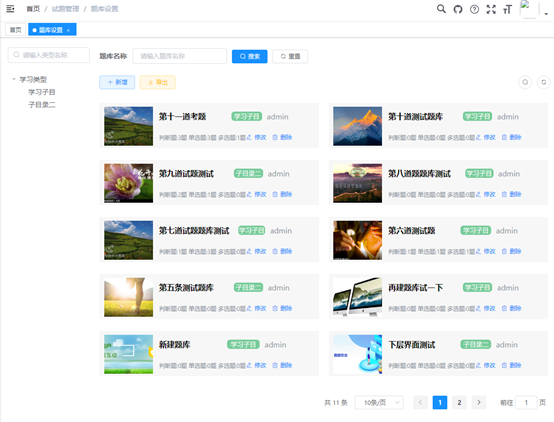

# 考试系统

#### 介绍
系统基于spring boot + vue开发，前端框架elementui，在若依/Ruoyi（Vue前后端分离版本）整体系统框架上开发了考试系统相关。
整个系统包括试题管理、考试组织、网上考试、以及资料管理四部分，资料管理只是作为图片、文件共享使用
请先阅读doc目录下《考试系统介绍》，内部有较为详尽功能说明，后续文档将说明数据表生成、源程序运行及部署

#### 功能简介
题库设置

